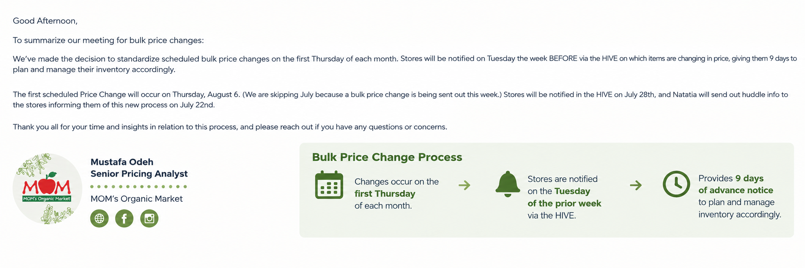

# Bulk Pricing Process Improvement

This project documents a pricing process improvement that standardized the timing and communication of scheduled bulk price changes across stores. Working cross-functionally with Store Operations and Bulk Category Management, I helped establish a recurring monthly pricing cadence with store communication occurring 9 days before implementation.

---

## Overview

This project focuses on improving the process used to communicate and implement bulk pricing changes across the organization.

The objective was to create a more consistent and predictable process for bulk price changes while giving Store Operations sufficient advance notice to plan and manage inventory.

---

## Problem Statement

The existing bulk pricing process required greater structure and coordination between Pricing, Category Management, and Store Operations.

The objective of this process improvement was to:

- Establish a consistent monthly pricing-change cadence
- Improve communication between Pricing and Store Operations
- Provide stores with advance notice of upcoming price changes
- Create a more predictable process for implementing bulk price changes

---

## Process Improvement

A standardized monthly process was established in collaboration with Store Operations and Bulk Category Management.

The updated process:

- Runs on the **first Thursday of each month**
- Provides stores with **9 days of advance notice**
- Establishes a consistent schedule for upcoming bulk price changes
- Improves coordination between Pricing, Category Management, and Store Operations

---

## Stakeholders

The process improvement required coordination across multiple teams, including:

- Pricing
- Bulk Category Management
- Store Operations
- Store Leadership

The process was discussed with the Store Operations Director and Bulk Category Managers to establish the new cadence and align stakeholders on the implementation process.

---

## Methodology

### 1. Process Review

The existing bulk pricing process was reviewed to identify opportunities to improve consistency, communication, and timing.

### 2. Stakeholder Alignment

Pricing, Bulk Category Management, and Store Operations were brought together to establish expectations and agree on a standardized process.

### 3. Process Design

A recurring monthly cadence was established for bulk price changes, with scheduled changes occurring on the **first Thursday of each month**.

### 4. Advance Communication

Stores are notified through HIVE on the **Tuesday of the prior week**, providing **9 days of advance notice** to plan and manage inventory accordingly.

---

## Business Impact

The process improvement established a standardized and repeatable approach to scheduled bulk price changes.

Key improvements included:

- Standardized bulk price changes to the **first Thursday of each month**
- Established **9 days of advance notice** for stores
- Improved cross-functional coordination
- Increased visibility for Store Operations
- Created a predictable monthly cadence for pricing changes
- Gave stores additional time to plan and manage inventory

---

## Key Skills Demonstrated

- Pricing process improvement
- Cross-functional collaboration
- Stakeholder management
- Retail pricing operations
- Process standardization
- Project leadership
- Business communication

